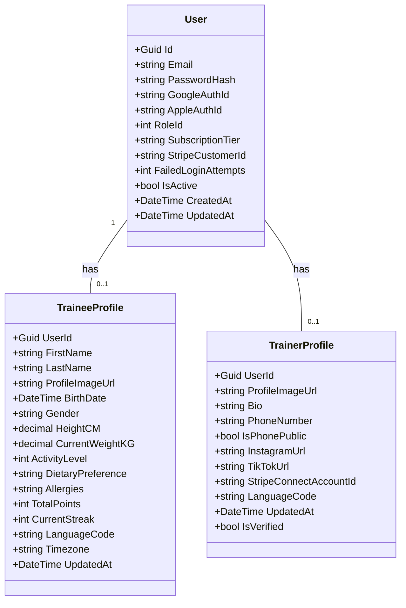

# תרשים מחלקות (UML Class Diagram) - מודול משתמשים

## 1. תרשים ויזואלי (Mermaid)
להלן תרשים המחלקות המייצג את שכבת הליבה (Core Entities) של המערכת.

## 2. טבלאות פירוט מחלקות (Class Specifications)

### מחלקת User (משתמש הליבה)
| הרשאה (Visibility) | שם התכונה (Property) | סוג הנתון (Type) | תיאור |
| :--- | :--- | :--- | :--- |
| `+` (Public) | **Id** | `Guid` | מזהה ייחודי של המשתמש. |
| `+` (Public) | **Email** | `string` | כתובת הדואר האלקטרוני. |
| `+` (Public) | **PasswordHash** | `string` | סיסמה מוצפנת. |
| `+` (Public) | **GoogleAuthId / AppleAuthId** | `string?` | מזהי התחברות חברתית (יכול להיות Null). |
| `+` (Public) | **RoleId** | `int` | מזהה תפקיד (1=מתאמן, 2=מאמן, 3=אדמין). |
| `+` (Public) | **SubscriptionTier** | `string?` | סטטוס מנוי נוכחי. |
| `+` (Public) | **StripeCustomerId** | `string?` | מזהה סליקה לחיובים. |
| `+` (Public) | **FailedLoginAttempts** | `int` | מונה ניסיונות התחברות שגויים. |
| `+` (Public) | **IsActive** | `bool` | סטטוס מחיקה רכה (Soft Delete). |
| `+` (Public) | **CreatedAt / UpdatedAt**| `DateTime` | חותמות זמן ליצירה ועדכון אחרון. |

### מחלקת TraineeProfile (פרופיל מתאמן)
| הרשאה (Visibility) | שם התכונה (Property) | סוג הנתון (Type) | תיאור |
| :--- | :--- | :--- | :--- |
| `+` (Public) | **UserId** | `Guid` | מזהה המשתמש המקושר (FK). |
| `+` (Public) | **FirstName / LastName** | `string` | שם פרטי ושם משפחה. |
| `+` (Public) | **ProfileImageUrl** | `string?` | קישור לתמונת הפרופיל בשרת. |
| `+` (Public) | **BirthDate** | `DateTime` | תאריך לידה (לחישוב גיל ו-BMR). |
| `+` (Public) | **Gender** | `string` | מין ביולוגי. |
| `+` (Public) | **HeightCM / CurrentWeightKG**| `decimal` | מדדי גוף. |
| `+` (Public) | **ActivityLevel** | `int` | רמת פעילות יומית. |
| `+` (Public) | **DietaryPreference** | `string?` | העדפות תזונה (למשל: טבעוני). |
| `+` (Public) | **Allergies** | `string?` | אלרגיות ורגישויות. |
| `+` (Public) | **TotalPoints / CurrentStreak**| `int` | נתוני גיימיפיקציה ומובילים. |
| `+` (Public) | **LanguageCode / Timezone**| `string` | הגדרות שפה ואזור זמן להתראות. |

### מחלקת TrainerProfile (פרופיל מאמן)
| הרשאה (Visibility) | שם התכונה (Property) | סוג הנתון (Type) | תיאור |
| :--- | :--- | :--- | :--- |
| `+` (Public) | **UserId** | `Guid` | מזהה המשתמש המקושר (FK). |
| `+` (Public) | **ProfileImageUrl** | `string?` | קישור לתמונת הפרופיל בשרת. |
| `+` (Public) | **Bio** | `string?` | ביוגרפיה מקצועית. |
| `+` (Public) | **PhoneNumber** | `string?` | טלפון ליצירת קשר. |
| `+` (Public) | **IsPhonePublic** | `bool` | האם הטלפון מוצג בפומבי. |
| `+` (Public) | **InstagramUrl / TikTokUrl**| `string?` | קישורים לרשתות חברתיות. |
| `+` (Public) | **StripeConnectAccountId**| `string?` | מזהה סליקה לקבלת תשלומים. |
| `+` (Public) | **IsVerified** | `bool` | האם המאמן עבר אימות על ידי האדמין. |

